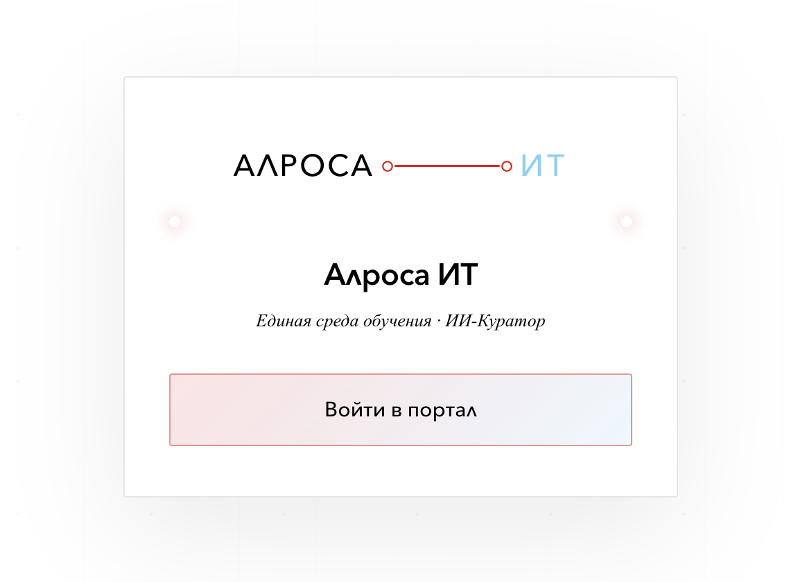
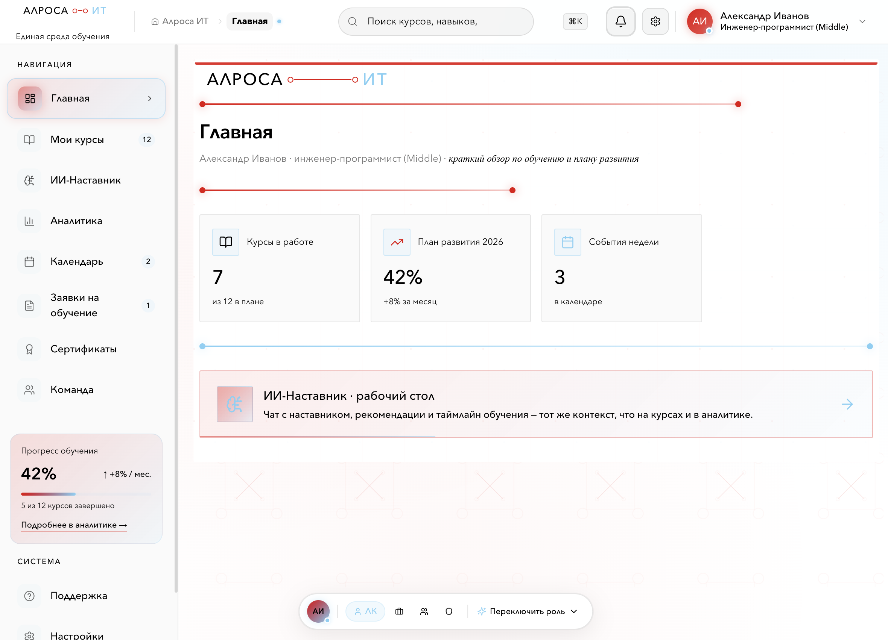
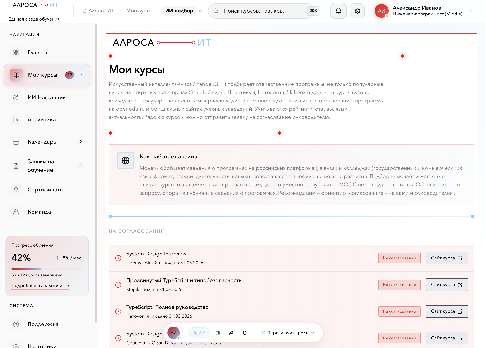
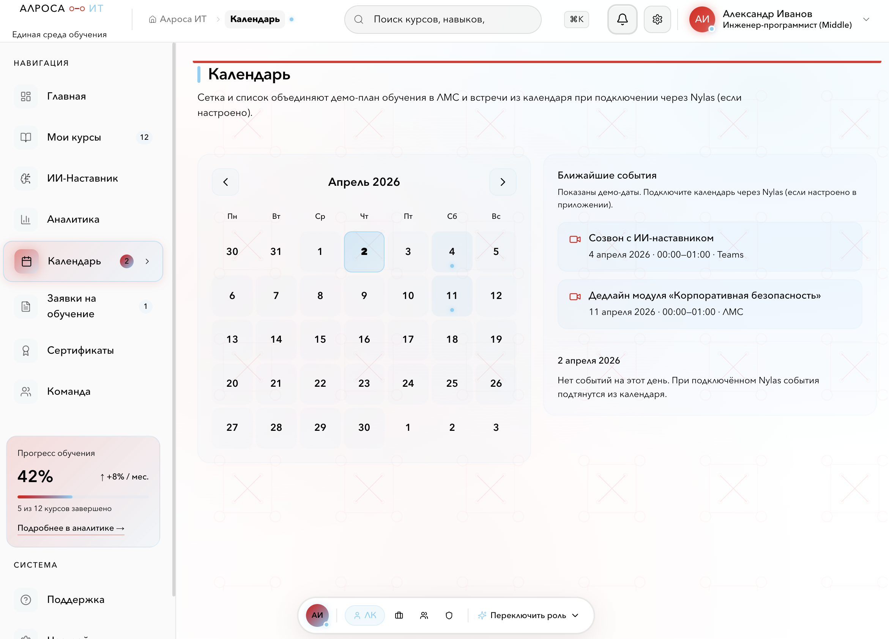
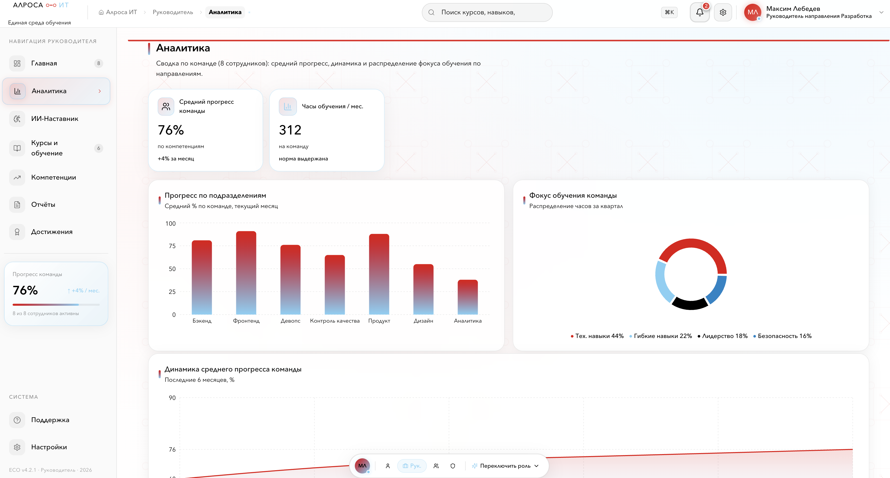
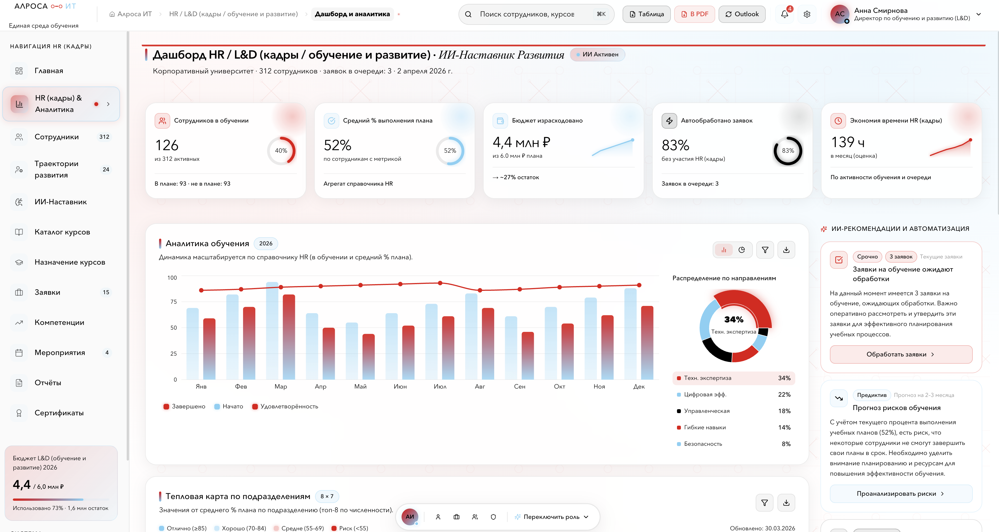
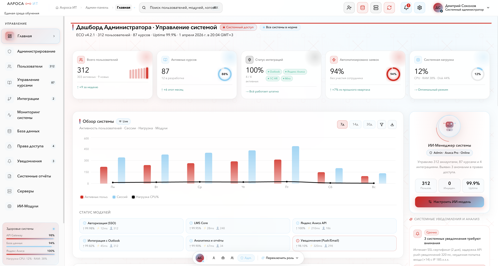
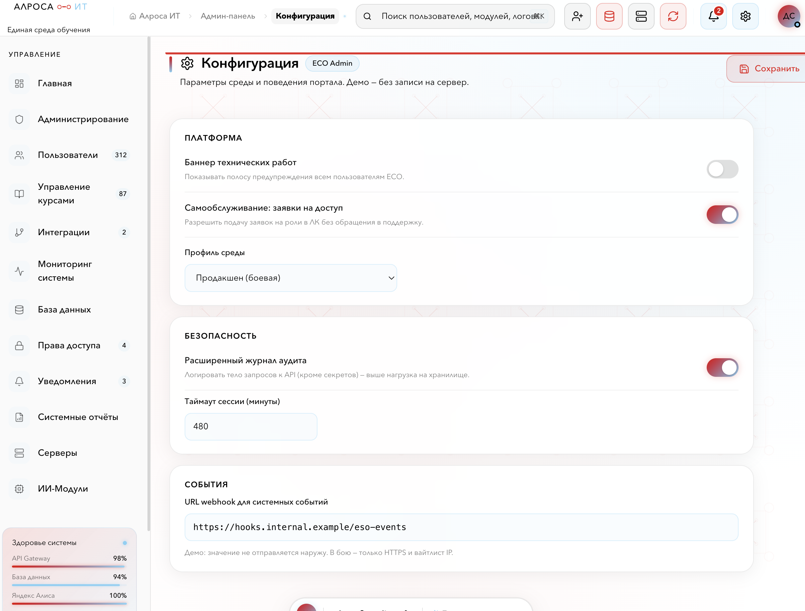

# Личный кабинет • ИИ-Куратор

Веб-приложение **единой среды обучения (ЕСО)** для сотрудников, руководителей, HR/L&D и администраторов: обучение, индивидуальные планы развития (ИПР), календарь, аналитика, ИИ-наставник, заявки на обучение, администрирование пользователей и интеграций.

---

## Содержание

- [Кратко о продукте](#кратко-о-продукте)
- [Технологии](#технологии)
- [Роли и маршруты](#роли-и-маршруты)
- [Запуск](#запуск)
- [Переменные окружения](#переменные-окружения)
- [Использование ИИ](#использование-ии)
- [Галерея скриншотов](#галерея-скриншотов)
- [Плюсы проекта](#плюсы-проекта)
- [Минусы и ограничения](#минусы-и-ограничения)

---

## Кратко о продукте

| Аспект | Описание |
|--------|----------|
| **Назначение** | Портал обучения и развития: курсы, траектории, сертификаты, календарь, поддержка, сценарии для HR и полноценная админ-панель. |
| **Тип** | Одностраничное приложение (SPA) на **React** с клиентской маршрутизацией; часть данных и сценариев — **демонстрационные** (моки). |
| **Авторизация** | Демо-вход; интеграции с **Яндекс ID** (Suggest), опционально **Microsoft** или **Яндекс Календарь** для календаря (см. `.env.example`). |
| **Деплой** | Сборка статики Vite; пример конфигурации **Vercel** — `vercel.json` (SPA fallback на `index.html`). |

Основные пользовательские потоки:

- **Сотрудник** — главная, личный кабинет, курсы, аналитика, календарь (в т.ч. внешний календарь при настройке), ИПР/заявки, сертификаты, «Моя команда», поддержка, настройки (язык, уведомления).
- **Руководитель** — отдельная оболочка `/manager`: команда, аналитика, ИИ-наставник по команде, курсы, компетенции, отчёты, достижения.
- **HR / L&D** — раздел `/hr`: сотрудники, траектории, каталог, назначение курсов, заявки, компетенции, мероприятия, отчёты, сертификаты, ИИ-наставник, настройки.
- **Администратор** — `/admin`: пользователи, курсы, интеграции, мониторинг, БД, доступы, уведомления, серверы, ИИ-модули, документация, конфигурация.

---

## Технологии

- **Runtime:** Node.js **≥ 20**
- **Сборка:** [Vite](https://vitejs.dev/) 6
- **UI:** React **18**, [React Router](https://reactrouter.com/) 7, [Motion](https://motion.dev/) (анимации), [Tailwind CSS](https://tailwindcss.com/) 4, часть компонентов **Radix UI** и **MUI**
- **Язык:** TypeScript
- **Опционально:** backend Python (`backend/`) — Uvicorn, прокси OAuth для календаря (локальный запуск — см. скрипты в `package.json`)
- **Прочее:** ESLint, `sonner` (тосты), `next-themes` (тема для Toaster), локализация строк (русский / английский) через контекст приложения

---

## Роли и маршруты

| Префикс | Назначение |
|---------|------------|
| `/` | После входа — сотрудник: главная, `/cabinet`, `/courses`, `/analytics`, `/employee/calendar`, `/idp`, `/certificates`, `/my-team`, `/support`, `/settings` |
| `/manager` | Руководитель (и редирект со старого `/team`) |
| `/hr` | HR/L&D |
| `/admin` | Администрирование |
| `/login` | Страница входа |

Подробная карта маршрутов — в `src/app/routes.ts`.

---

## Запуск

```bash
npm install
npm run dev
```

Откройте в браузере адрес, который выведет Vite (обычно `http://localhost:5173/`).

**Production-сборка:**

```bash
npm run build
```

Артефакты в каталоге `dist/`.

**Проверки:**

```bash
npm run typecheck
npm run lint
```

---

## Переменные окружения

Шаблон — **`.env.example`** в корне проекта. Типичные группы:

- **Яндекс OAuth** — для сценариев с Яндекс.Календарём / API (префикс `VITE_` для публичных ключей клиента); обмен кодов и календарь — также через `backend/` при необходимости.
- **Яндекс Cloud / GPT** — при использовании HR-ИИ (см. комментарии в `.env.example`).

Секреты не коммитьте; для продакшена используйте переменные окружения хостинга.

---

## Использование ИИ

В продукте ИИ — это **модели Yandex Foundation Models** (ЯндексGPT / Алиса) в облаке [Yandex Cloud](https://yandex.cloud/ru/docs/foundation-models/). Вызовы сосредоточены в `src/app/lib/deepseekClient.ts` (единая функция чата с API completion); промпты и разбор ответов — в модулях `yandexOrgInsights`, `deepseekSearchAssistant`, `deepseekCoursePicks`, `deepseekIdpMentor`.

### Подключение

- В **`.env`** задаётся **`YANDEX_CLOUD_API_KEY`** (сервисный ключ API; см. `.env.example`).
- В режиме **`npm run dev`** запросы к LLM идут на относительный путь **`/yandex-llm-api/...`**: Vite проксирует на `llm.api.cloud.yandex.net` и подставляет ключ из окружения **на стороне dev-сервера**, чтобы ключ не светился в исходниках страницы.
- Альтернатива для отладки — **`VITE_YANDEX_CLOUD_API_KEY`**: тогда запрос уходит из браузера напрямую (ключ попадает в клиентский бандл; для продакшена так делать не стоит).
- При необходимости уточняют каталог и модель: **`VITE_YANDEX_FOLDER_ID`**, **`VITE_YANDEX_MODEL`** или полный **`VITE_YANDEX_MODEL_URI`** (должны соответствовать правам ключа).

### Где используется в интерфейсе

| Зона | Маршрут / экран | Назначение |
|------|-----------------|------------|
| **HR** | `/hr/mentor`, дашборд HR | Карточки инсайтов и сводка по обучению: в промпт передаётся JSON-срез по демо-данным (`orgDataSnapshot`). При ошибке API показываются запасные демо-карточки. |
| **Руководитель** | `/manager`, `/manager/mentor` | Рекомендации по команде (JSON по срезу подчинённых) и диалог ИИ-наставника; можно открыть контекст выбранного сотрудника из URL. |
| **Сотрудник** | Глобальный поиск в шапке | Умное ранжирование: модель выбирает id из заранее заданного каталога сущностей портала по запросу пользователя. |
| **Сотрудник** | `/courses` | Блок «ИИ-подбор» курсов: ответ в JSON, ссылки и поля нормализуются на клиенте. |
| **Админка** | `/admin/ai-modules` | Справочник включённых и планируемых ИИ-модулей (описание для администратора, не отдельный runtime). |

Ответы часто ожидаются в **формате JSON** (строгие схемы в системных промптах); для свободного текста используется обычный чат с историей сообщений.

### Ограничения

- Контекст для HR и руководителя строится из **демо-справочников и локальных данных** приложения, а не из боевого HR API.
- Для **продакшена** имеет смысл вынести вызовы LLM на **свой бэкенд** (хранение ключа, квоты, логирование, политики контента).
- Модуль **`deepseekIdpMentor`** (план ИПР через ИИ) в коде есть; подключение к экранам заявок можно доработать отдельно.

---

## Галерея скриншотов

Ниже — вставки для типовых экранов. **Файлы нужно один раз добавить** в каталог [`docs/screenshots/`](docs/screenshots/) (см. [docs/screenshots/README.md](docs/screenshots/README.md)). Пока файлов нет, в Git-клиенте картинки могут не отображаться — это нормально.

| Экран | Предпросмотр |
|-------|----------------|
| Вход |  |
| Главная сотрудника |  |
| Курсы |  |
| Календарь |  |
| Руководитель |  |
| HR — дашборд |  |
| Админка |  |
| Настройки |  |

**Как сделать скрины:** запустите `npm run dev`, пройдите по маршрутам из таблицы в `docs/screenshots/README.md`, сохраните PNG под указанными именами.

---

## Плюсы проекта

1. **Охват сценариев** — четыре роли в одном репозитории, единая дизайн-система (фирменные цвета, шапки, боковые панели, переходы страниц).
2. **Современный стек** — Vite, React 18, TypeScript, предсказуемая структура `src/app`.
3. **UX** — анимации переходов, колокольчики уведомлений с сохранением «прочитано», настройки уведомлений, мобильное меню где предусмотрено.
4. **Интеграции (по конфигурации)** — Яндекс ID, календарь (Яндекс Календарь при настройке), опциональный Python-backend для обмена кодов OAuth.
5. **Локализация** — переключение языка (RU/EN) на странице настроек.
6. **Сборка и типы** — скрипты `typecheck` и `lint`, готовность к CI.
7. **Деплой** — статическая сборка, пример для Vercel с rewrite для SPA.

---

## Минусы и ограничения

1. **Демо-данные** — значительная часть списков, заявок и метрик рассчитана на демонстрацию; без своего API это не полноценная корпоративная LMS «из коробки».
2. **Безопасность** — демо-авторизация; токены и настройки на клиенте требуют пересмотра перед боевым использованием.
3. **Зависимость от внешних сервисов** — Яндекс OAuth, календарные API, опционально Яндекс Cloud — нужны регистрация приложений и секреты.
4. **Размер фронтенда** — много UI-библиотек (Radix, MUI и др.); следите за бюджетом бандла при росте проекта.
5. **Смешение стилей** — inline-стили и CSS-модули/глобальные стили; единый подход к стилям при масштабировании упростит поддержку.
6. **Имя пакета** — в `package.json` до сих пор может отображаться шаблонное имя (`@figma/my-make-file`); имеет смысл переименовать под продукт.
7. **Календарь сотрудника** — интеграция внешнего календаря завязана на настроенный **Яндекс Календарь** (см. `EmployeeCalendarPage`).
8. **Тесты** — в репозитории нет описанного набора e2e/юнит-тестов для UI; для продакшена стоит добавить минимальный контур тестов и мониторинга.

---

## Лицензии и атрибуция

Сторонние компоненты и лицензии — в файле [ATTRIBUTIONS.md](ATTRIBUTIONS.md).

---

*Документ можно дополнять по мере развития продукта: новые скриншоты, ссылки на staging/production, контакты команды.*
